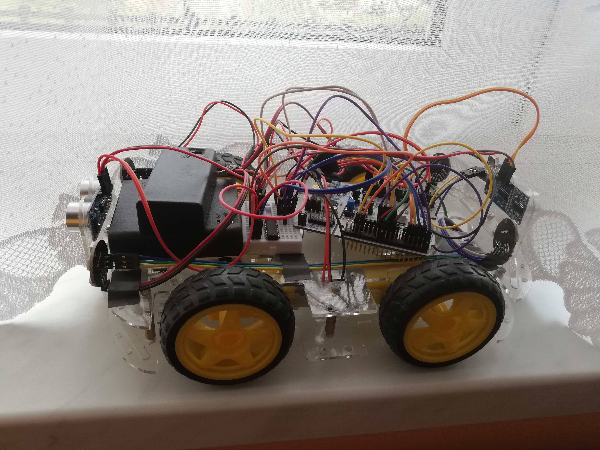

# IR-Controlled Mini Car

A remote-controlled mini vehicle powered by an STM32L476RG microcontroller. The car receives infrared (IR) commands from a standard remote control and responds with movement, lighting simulation, obstacle avoidance, and acoustic signals. Designed as a compact embedded system with real-time control using interrupts, timers, and DMA.

---

## Project Goals

This project was developed to practice and demonstrate:

- Real-time control using **interrupts** (IR decoding, ultrasonic sensing)
- **3-level PWM motor control** via DRV8835
- **SPI + DMA-based control** of WS2812B RGB LEDs
- **Obstacle detection** using ultrasonic sensors (HC-SR04)
- Peripheral integration via **STM32 HAL** in STM32CubeIDE
- Custom power supply handling with **step-up/down regulator**
- Preparation for future **PCB design** and full integration

---

## Features

- Remote control via NEC-compatible IR remote
- Movement:
  - Forward / backward drive with 3 selectable speed levels (+/- buttons)
  - Left / right steering (Left/Right arrows)
  - Instant stop (red ON/OFF button)
- Lighting simulation using WS2812B RGB LEDs:
  - Low beams (toggle via MENU button)
  - Brake lights (automatic when not moving)
  - Reverse lights (automatic when moving backward)
  - Hazard warning lights (button 2 + buzzer pulses)
  - Turn signals (left = button 1, right = button 3) + buzzer pulses
- Horn function triggered by pause/play button
- Obstacle detection:
  - 2x HC-SR04 (front and rear)
  - Auto-stop when an obstacle is detected
  - Audible warning
  - Motion in that direction is blocked until obstacle is cleared

---

## Hardware Overview

- **Microcontroller**: STM32L476RG (Nucleo board)
- **IR Receiver**: VS1838B (connected to Timer input channel)
- **Motor Driver**: DRV8835 dual H-bridge (4 motors - 2 motors to one channel)
- **Distance Sensors**: 2x HC-SR04 (front and rear)
- **Lighting**: 4x WS2812B RGB LEDs arranged in a  7-circle
  - Driven via **SPI + DMA** for accurate timing
- **Buzzer**: Passive buzzer (requires PWM signal)
- **Power System**:
  - 4x AA 1.5V batteries for motor power (connected to DRV8835)
  - 9V battery for logic, regulated via **Pololu S7V7F5 step-up/down to 5V**
- **Build stage**: Breadboard prototype; PCB version planned

---

## How It Works

1. On startup, the system initializes:
   - HAL peripherals (GPIO, Timers, PWM, SPI, DMA)
   - IR receiver and DRV8835 motor driver
   - WS2812 LEDs with initial headlight state
   - HC-SR04 ultrasonic sensors for obstacle detection

2. IR commands are received through an IR receiver (VS1838B).
   - Signal edges are captured using a **Timer in input capture mode**
   - Time intervals between pulses are measured and decoded (NEC protocol)

3. Movement control:
   - Forward/backward: +/- buttons with 3 speed levels (PWM duty cycle)
   - Left/right steering: Left/Right buttons
   - Stop: ON/OFF (red) button triggers full brake
   - Detecting an obstacle also triggers full brake

4. Lighting simulation with WS2812:
   - Low beams: toggle with MENU
   - Brake lights: active when car is not moving
   - Reverse lights: active during backward motion
   - Hazard warning lights: button 2 (with buzzer sygnals)
   - Turn signals: left = button 1, right = button 3 (with buzzer signals)

5. Horn: activated with pause/play button

6. Obstacle detection:
   - Sensors constantly monitor front and rear zones
   - If an object is detected in the current direction of movement:
     - Movement is stopped
     - Buzzer sounds warning
     - Further motion in that direction is disabled until cleared

---

## Getting Started

1. Clone this repository.
2. Open the project in STM32CubeIDE.
3. Flash the firmware to STM32L476RG (e.g. Nucleo board).
4. Connect all components according to pin definitions in `cube generated peripheral files` (breadboard setup).
5. Power the system:
   - Motors: 4x AA battery pack
   - Logic: 9V battery via Pololu S7V7F5 step-up/down converter
6. Use a NEC-compatible IR remote to control the car ([e.g.](photos/remote.jpg))

---

## Tools & Dependencies

- STM32CubeIDE (STM32 HAL drivers)
- NEC-compatible IR remote control
- IR receiver: VS1838B
- Motor driver: DRV8835
- Distance sensors: 2x HC-SR04
- WS2812B RGB LEDs (4x7-circle, SPI-driven)
- Buzzer (PWM)
- Power: 9V battery + 4x AA battery pack + S7V7F5 regulator
- Breadboard + jumpers (for prototype version)

---

## Future Plans / TODO

- Design custom PCB and wiring schematic
- Add speed ramping logic for smooth acceleration
- Improve obstacle detection filtering (avoid false triggers)
- Migrate to CMake-based build system with IDE-independent scripts
- Replace HAL drivers with direct register access
- Introduce an RTOS for task scheduling

---

## More images [here](photos)
